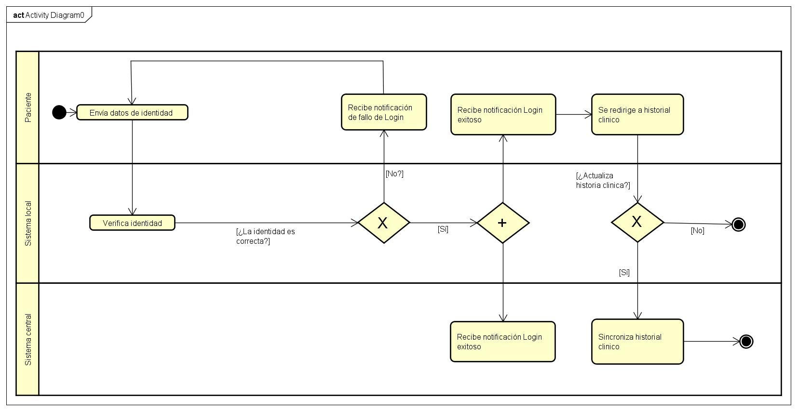

# 📄 Informe Técnico del Taller

## 🔖 Nombre del Taller
Informe — Proceso de Registro y Actualización de Historia Clínica

## 👥 Integrantes del equipo
- Edwin Gutierrez edwingutro@unisabana.edu.co
- Samuel Espitia samuelescr@unisabana.edu.co
- Nicolas Ortiz nicolasorco@unisabana.edu.co
- Mateo Gonzales meteogoca@unisabana.edu.co
- Santiago Sanchez santiagosaca@unisabana.edu.co
- Santiago Santafe andressasi@unisabana.edu.co

## 🧠 Descripción general del trabajo
Este taller tuvo como objetivo modelar el proceso de verificación de identidad y actualización/sincronización de la historia clínica electrónica en una organización con múltiples sedes y sistemas desconectados. Se incluyeron flujos alternos para manejo de historia clínica duplicada, datos desactualizados y notificaciones al paciente, aplicando criterios de buenas prácticas BPMN.

## 🔧 Proceso de desarrollo
El trabajo inició con la revisión del caso base y la identificación de los actores clave. Se optó por modelar primero el flujo principal y luego integrar flujos alternos y eventos de excepción. Se utilizó una herramienta de modelado compatible con BPMN 2.0, aplicando lineamientos de Camunda y Signavio. Se decidió separar el registro de nueva consulta como subproceso para mantener el diagrama principal enfocado.

## 🧩 Análisis del modelo propuesto

- **Estructura:** El proceso está dividido en tres lanes (Paciente, Sistema Local, Sistema Central) que representan claramente la interacción entre actores. Se utilizan gateways para el control de flujo según la verificación de identidad y la decisión de actualización de la historia clínica.

- **Representación de necesidades:** Se garantiza la validación de identidad antes de permitir el acceso, mostrando notificaciones claras en caso de error o éxito. Además, se contempla la actualización condicional de la historia clínica, asegurando la consistencia de los datos y evitando mostrar información desactualizada.

- **Supuestos:** El sistema central está siempre disponible y puede sincronizar la historia clínica de forma inmediata. Se asume que la comunicación entre el sistema local y el central es estable y segura.

## 📈 Diagrama final entregado

## 📋 Tabla de actores, entidades o componentes (si aplica)

| Nombre                | Tipo     | Descripción                                           | Responsable       |
|-----------------------|----------|-------------------------------------------------------|-------------------|
| **Paciente**          | Actor    | Usuario que solicita acceso a la historia clínica     | Cliente           |
| **Sistema local (Sede)** | Sistema  | Gestiona la identidad y datos locales                 | Área TI local     |
| **Sistema central**   | Sistema  | Repositorio clínico corporativo                       | Área TI central   |

Buenas prácticas BPMN aplicadas.

- **Líneas de nado claras** (Paciente / Sistema local / Sistema central) para separar responsabilidades y mensajes.
- **Gateways con salidas rotuladas** (“Sí/No”) y **unificación de finales** cuando representan el mismo cierre lógico, evitando merges implícitos.
- **Eventos/actividades de excepción** para casos como **duplicados**, en lugar de sobrecargar gateways con lógica de error.
- **Subprocesos** para mantener un nivel de detalle manejable.
- **Nombres consistentes**: verbo + objeto en actividades (p. ej., “Verificar identidad”, “Sincronizar historia clínica”).

## 🔍 Investigación complementaria
**Tema investigado:** Buenas prácticas BPMN y ejemplos en la industria.

**Resumen:**  
La especificación BPMN 2.0 (OMG) y guías de Camunda y Signavio recomiendan diagramas claros, gateways etiquetados y uso de eventos intermedios para interacciones externas. En salud, BPMN se usa para modelar procesos hospitalarios, como admisión y triage, reduciendo errores y mejorando la trazabilidad. En otras industrias, se aplica en finanzas (gestión de reclamaciones) y logística/retail, demostrando versatilidad y eficacia.

### Salud — Vías clínicas y guías médicas
Conversión de guías clínicas a BPM: Estudios publicados demuestran cómo transformar algoritmos médicos (como en cardiología) en modelos BPMN vinculados con DMN y CMMN, mejorando la trazabilidad y reutilización.

Revisión de desafíos hospitalarios: Identifica problemas comunes (variabilidad clínica, datos incompletos, cumplimiento) y propone patrones y gobernanza de modelos BPMN en el sector salud. *Pufahl et al., 2022*.

### Otros sectores (breve)
- **Finanzas/seguros:** Procesos de KYC, onboarding y gestión de siniestros modelados con subprocesos y eventos de mensaje/tiempo (patrones de espera y SLA).  
- **Logística/retail:** Orquestación de pedidos, devoluciones y compensaciones (combinando transacciones y eventos temporales) en cadenas con múltiples actores.

---

## 📚 Referencias

1. Object Management Group. (2011). *Business Process Model and Notation (BPMN) Version 2.0*. https://www.omg.org/spec/BPMN/2.0/
2. Camunda. (s. f.). *Best practices overview*. https://docs.camunda.io/docs/components/best-practices/best-practices-overview/
3. Signavio. (2020). *BPMN modeling conventions: A comprehensive guide*. https://www.signavio.com/post/bpmn-modeling-conventions/
4. Pufahl, L., et al. (2022). *BPMN in healthcare: Challenges and best practices*. *Information Systems*. https://www.sciencedirect.com/science/article/pii/S0306437922000217

---

_Este documento hace parte de la entrega del taller X del curso AREM (Arquitectura Empresarial) - Universidad de La Sabana._
